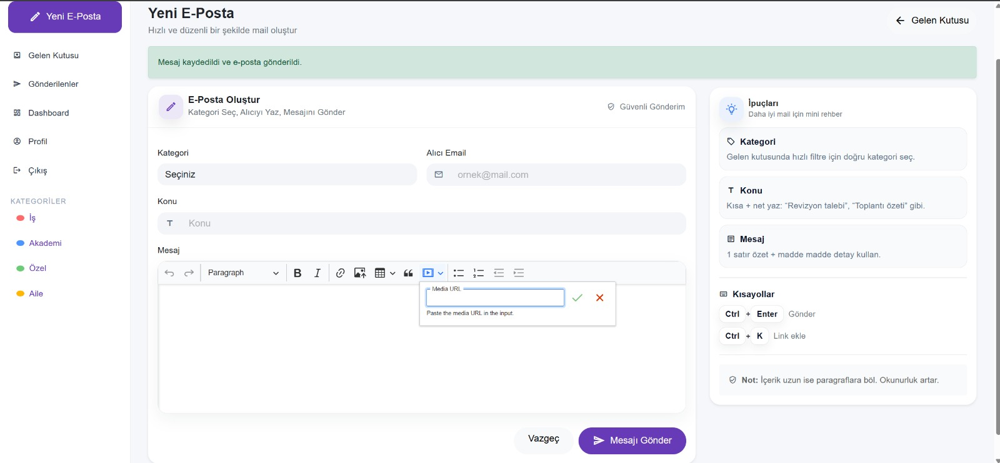
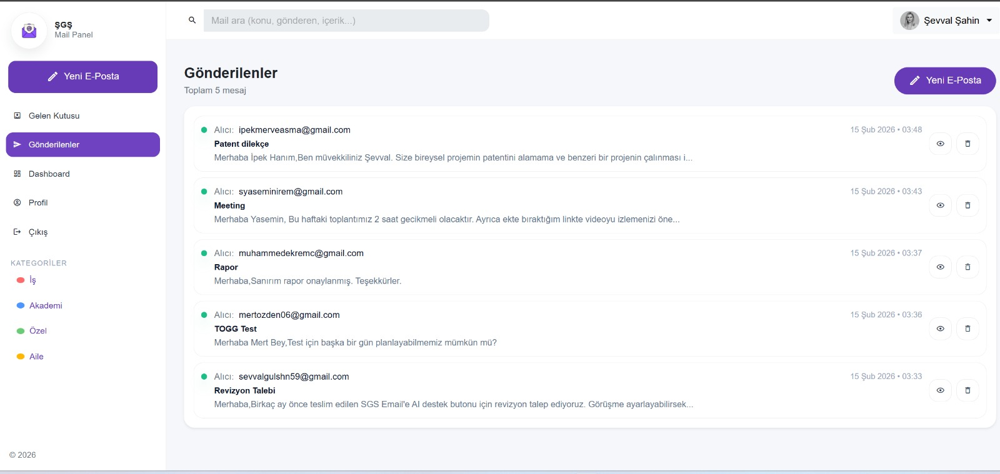
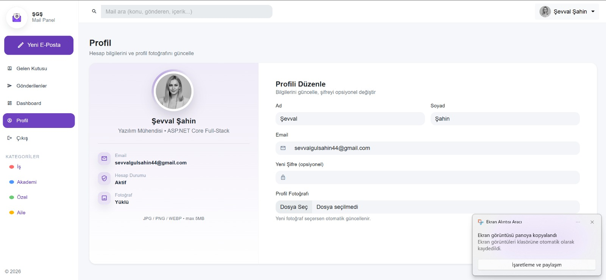
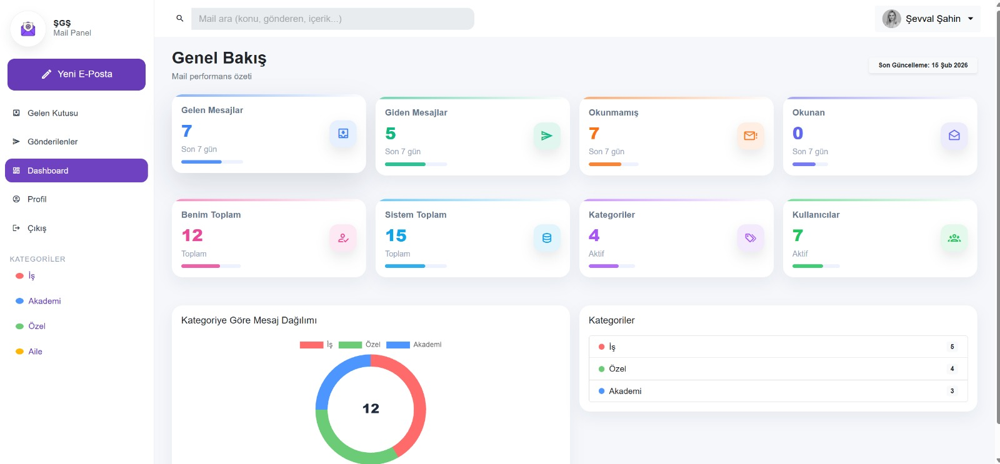

📧 MailManagementPlatform
ASP.NET Core Identity Based Dynamic Email Management System

MailManagementPlatform, ASP.NET Core MVC mimarisi kullanılarak geliştirilmiş, kimlik doğrulama ve kategori bazlı mesaj yönetimi sağlayan dinamik bir Email Yönetim Sistemidir.

Proje; güvenli kullanıcı yönetimi, SMTP entegrasyonu ve Code First yaklaşımı ile tasarlanmış sürdürülebilir bir backend mimarisi üzerine inşa edilmiştir. Gerçek bir email istemcisinin temel operasyonlarını web ortamında simüle eden ölçeklenebilir bir yapı sunar.

🎯 Projenin Amacı

Bu proje;

Güvenli kimlik doğrulama süreçlerini yönetmeyi

Kullanıcı bazlı mail akışını kontrol etmeyi

Mesajları kategori bazlı organize etmeyi

SQL Server destekli kalıcı veri yönetimi sağlamayı

Code First yaklaşımı ile versiyonlanabilir veritabanı mimarisi oluşturmayı

amaçlamaktadır.

🔐 Kimlik Doğrulama & Güvenlik

Sistem, ASP.NET Core Identity altyapısı ile yapılandırılmıştır.

Sağlanan güvenlik mekanizmaları:

Kullanıcı kayıt (Register)

Kullanıcı giriş (Login)

Email doğrulama / Confirm Code akışı

Cookie tabanlı Authentication

Rol ve kullanıcı bazlı erişim kontrolü

Yetkisiz erişimlerde otomatik yönlendirme

Identity altyapısı sayesinde parola hashleme, token üretimi ve kullanıcı doğrulama süreçleri framework seviyesinde yönetilmektedir.

📬 Mail Yönetim Modülleri

Uygulama, mail içeriklerini kategori bazlı yönetmeye olanak sağlar.

Desteklenen kategoriler:

Inbox (Gelen Kutusu)

Sent (Gönderilenler)

Draft (Taslaklar)

Trash (Çöp Kutusu)

Mail yönetim özellikleri:

Okundu / Okunmadı durum takibi

Pagination destekli performanslı listeleme

Subject ve kullanıcı bazlı arama

Kategori bazlı filtreleme

SMTP (MailKit) ile gerçek mail gönderimi

🏗️ Mimari Yapı

Proje, katmanlı ve sürdürülebilir bir yapı hedeflenerek geliştirilmiştir.

Katmanlar:

Entities → Veri modelleri

Dtos → Veri transfer nesneleri

Controllers → İş mantığı & endpoint yönetimi

Context → DbContext & veritabanı yönetimi

Views → Razor tabanlı arayüz katmanı

DTO kullanımı ile Controller katmanında doğrudan Entity manipülasyonu engellenmiş ve daha güvenli bir yapı sağlanmıştır.

🗄️ Veritabanı Yönetimi

Microsoft SQL Server

SQL Server Management Studio (SSMS)

Entity Framework Core (Code First)

EF Core Migrations ile versiyonlanabilir şema yönetimi

Migration yapısı sayesinde veritabanı şeması kod üzerinden yönetilebilir hale getirilmiştir.

🛠️ Kullanılan Teknolojiler
Backend

ASP.NET Core MVC

ASP.NET Core Identity

Entity Framework Core (Code First)

MailKit (SMTP)

Database

Microsoft SQL Server

SSMS

Frontend

HTML5

CSS3

Bootstrap

JavaScript

Tooling

Git & GitHub

Visual Studio

Postman

🚀 Öne Çıkan Teknik Kazanımlar

Identity tabanlı güvenli kullanıcı yönetimi

SMTP entegrasyonu ile gerçek mail gönderimi

Code First + Migration tabanlı veritabanı yönetimi

Pagination ile performanslı veri listeleme

Kategori bazlı dinamik mesaj organizasyonu

Cookie-based authentication mimarisi

📸 Application Screenshots
#### 🔐 Login

#### 📝 Register

#### 📥 Inbox

#### ✉️ New Message

#### 📤 Send Mail

#### 📄 Email Detail

#### 👤 Profile

#### 📊 Dashboard

